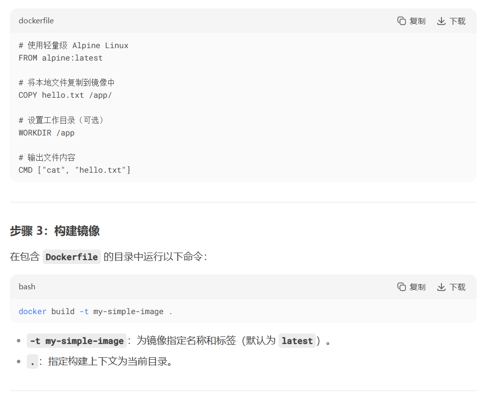
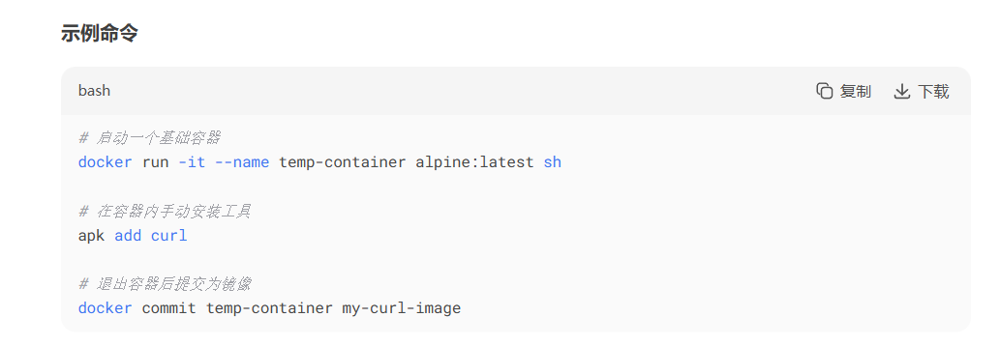

# Docker

**docker安装使用yum需要注意，是docker-ce，[相关教程1](https://blog.csdn.net/weixin_43755251/article/details/127512751?ops_request_misc=%257B%2522request%255Fid%2522%253A%2522e9895de5cc1319c006efe87617395611%2522%252C%2522scm%2522%253A%252220140713.130102334..%2522%257D&request_id=e9895de5cc1319c006efe87617395611&biz_id=0&utm_medium=distribute.pc_search_result.none-task-blog-2~all~top_positive~default-1-127512751-null-null.142^v102^pc_search_result_base7&utm_term=Linux%E5%AE%89%E8%A3%85docker&spm=1018.2226.3001.4187)[相关教程2](https://blog.csdn.net/m0_59196543/article/details/124749175?ops_request_misc=%257B%2522request%255Fid%2522%253A%2522e9895de5cc1319c006efe87617395611%2522%252C%2522scm%2522%253A%252220140713.130102334..%2522%257D&request_id=e9895de5cc1319c006efe87617395611&biz_id=0&utm_medium=distribute.pc_search_result.none-task-blog-2~all~top_positive~default-4-124749175-null-null.142^v102^pc_search_result_base7&utm_term=Linux%E5%AE%89%E8%A3%85docker&spm=1018.2226.3001.4187)**——————用老版本docker镜像换源怎么换都访问不了，最后发现是版本问题，真的是干裂开了

## 理论相关

是一个开源的**应用容器**引擎，采用的是cs架构

优势体现在存储应用程序上，在日志以及数据方面并不擅长

它启动快的一个重要原因是没有抽象层(跟虚拟机比)同时不需要内核直接依赖宿主机

 平时我们安装进虚拟机的CentOS都是好几个G，**为什么Docker这里才200M** ?

对于一个精简的OS , rootfs可以很小，只需要包含最基本的命令工具和程序库就可以了，因为底层直接用Host的kernel，自己只需要提供rootfs就可以了。由此可见对于不同的linux发行版, bootfs基本是一致的, rootfs会有差别,因此不同的发行版可以公用bootfs。

Docker的内核主要部分是rootfs并且其内核并不完整，还经过优化和压缩处理

Bootfs与rootfs都属于联合文件系统(UnionFS)，有UnionFS实现的overlayFS属于Linux内核(Linux kernel)的一部分

Docker可以通过yum直接安装——yum -y install docker

**镜像**是一种轻量级的、可执行的独立软件包

Docker镜像加载采用的是UnionFS（联合文件系统）

### 数据卷容器技术：容器间共享数据

主要参数--volumes-from(参考java的extend)

docker的一种备份机制技术，当父容器被删除，保证子容器依旧可以访问，本质是**目录的挂载**，出现的原因是为了防止docker容器删除后，数据也被删除的情况即保存**容器内的数据的需要**，**持久化数据和同步化操作的需要**

关于具名挂载与匿名挂载的区别就在于**是否指定了挂载位置**
主要参数是-v

### dockerfile与docker commit
Dockerfile 和 docker commit 是两种不同的镜像构建方式

dockerfile基础用法如图： 

docker commit用法如图：

####  **两者对比(列表)**
| **维度**         | **Dockerfile**                          | **docker commit**                     |
|-------------------|-----------------------------------------|----------------------------------------|
| **构建方式**      | 声明式（代码驱动）                      | 快照式（手动操作容器后提交）           |
| **可重复性**      | ✅ 完全一致                             | ❌ 依赖容器临时状态                    |
| **维护性**        | ✅ 版本可控，易于更新                   | ❌ 难以维护和复现                      |
| **镜像体积**      | ✅ 优化分层，体积较小                   | ❌ 可能包含冗余文件，体积较大          |
| **适用场景**      | 生产环境、自动化流程、团队协作          | 临时调试、实验性操作                   |
| **学习成本**      | 较高（需掌握语法）                      | 低（仅需基础命令）                     |

---

#### **相关建议**
1. **优先使用 Dockerfile**：  
   - 所有生产环境镜像必须通过 `Dockerfile` 构建，确保可审计性和一致性。
   - 将 `Dockerfile` 纳入版本控制（如 Git）。

2. **谨慎使用 docker commit**：  
   - 仅作为调试辅助工具，生成临时镜像后需及时清理。
   - 若需长期使用 `docker commit` 生成的镜像，应反向生成 `Dockerfile`（如使用 `docker history` 分析）。

3. **结合使用场景**：  
   - **开发阶段**：可用 `docker commit` 快速保存调试结果，但最终需将操作步骤转化为 `Dockerfile`。
   - **紧急修复**：先用 `docker commit` 生成临时镜像，随后补充 `Dockerfile` 并重新构建。

---

#### **扩展技巧**
- **从容器反向生成 Dockerfile**：  
  使用工具（如 `docker history` 或第三方工具 `dfimage`）分析镜像层，尝试还原近似 `Dockerfile`：
  ```bash
  docker run --rm -v /var/run/docker.sock:/var/run/docker.sock cucker/image-history my-curl-image
  ```

- **清理临时镜像**：  
  定期清理通过 `docker commit` 生成的镜像，避免仓库臃肿：
  ```bash
  docker image prune -f
  ```

---

通过合理选择 `Dockerfile` 和 `docker commit`，可以在效率与可维护性之间找到平衡，满足不同场景的需求。


### docker与看k8s的关系

Docker是容器化平台，提供容器的运行环境；K8s是容器编排平台，管理多个Docker容器的部署、扩展、运行等。Docker负责打包和运行容器，而K8s则负责容器集群的自动化管理和编排。两者在现代应用部署和管理中通常结合使用，以构建稳定可靠且可扩展的容器化应用程序环境。

## 命令相关：

基础命令——docker searcher xxx、docker pull xxx、docker images xxx

### 启动镜像：

启动镜像方法
`docker run -it(d)  ImageId /bin/bash`

### 进入容器：

docker exec -it ContainerId /bin/bash

\# docker exec#进入容器后开启一个新的终端，可以在里面操作（常用)

\# docker attach #进入容器正在执行的终端，不会启动新的进程!

### 停止删除相关：

`docker stop ContainerId与docker start ContainerId `
停止/启动已有容器

`docker rm ContainerId` 
删除容器

`docker rmi ImageId` 
删除镜像

### 其他：

`docker run -d -p 8089:80 ImageId` 
将指定镜像端口80映射到宿主机的8089上

`docker cp /path/to/file container_id_or_name:/path/inside/container`
将宿主机文件复制到容器中

`docker Images`
查询所有镜像

`docker commit container_id_or_name new_image_name:tag`
提交保存当前镜像信息

`docker ps -a`
查询所有容器、

查询服务状态可用systemctl、

docker inspect ContainerId查询具体容器信息


Docker的命令敲下运行之后，对应程序会开始工作比如寻找比如下载，其他的应用程序也估计差不多

**docker镜像、远程仓库(阿里云仓库)**

**docker login** --username=aliyun2731059355 registry.cn-hangzhou.aliyuncs.com ——登录

**docker tag** [ImageId] registry.cn-hangzhou.aliyuncs.com/wangyaofu/test1——准备上传标记

**docker push** registry.cn-hangzhou.aliyuncs.com/wangyaofu/test1:——上传镜像

**docker pull** registry.cn-hangzhou.aliyuncs.com/wangyaofu/test1:

——拉取镜像

