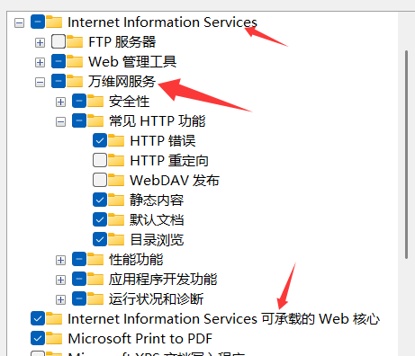

# 建站相关
## Vue
### 常用命令：
npm run docs:dev  运行启动
vuepress build docs 构建资源并打包(打包好的资源会出现在.vuepress文件夹下)

### 其他
vuepress
vuepress项目的依赖随用随装，尽量不要用全局

先安装vue，然后vuepress
相关链接：
[vue的安装](https://blog.csdn.net/Javachichi/article/details/132868889)
[vuepress的安装](https://blog.csdn.net/xiaoxianer321/article/details/119548202)
[Plume主题](https://theme-plume.vuejs.press/)

待解决问题：vuepress项目打包后路径不对...

## Hexo相关

准备工作:node,git

### 常用命令：
npm install -g hexo-cli 安装工具
hexo init 初始化
git xxxx 获取主题
hexo s(erver) 运行启动
hexo g(enerate) 生成静态文件
hexo d(elay)上传

### 注意事项
主要操作配置文件是主项目下的_config.yml和主题目录下的_config.yml文件
1. [基础教程](https://webfem.com/post/hexo)

2. 注意该路径会影响样式的读取

3. [利用GitHub-Page完成hexo博客的免服务器服务器搭载1](https://blog.csdn.net/2303_76953932/article/details/145233223)；
[利用GitHub-Page完成hexo博客的免服务器服务器搭载2](https://zhuanlan.zhihu.com/p/60578464)。
注意GitHub中的仓库名、注意事项2中的路径

4. hexo中更新数据提交到GitHub仓库需要**清除缓存(clean)、重新生成(generate)、然后在上传(delay)。**注意最后一步上传需要关闭加速器否则会报错

# IIS相关
使用IIS站点，需要现在控制面板中找到程序并开启相应的IIS服务，然后配置IIS站点
[教程链接](https://blog.csdn.net/weixin_42032770/article/details/128588460?ops_request_misc=%257B%2522request%255Fid%2522%253A%2522bd97fa3d7aa9fb7c90e63fc6aea9d16b%2522%252C%2522scm%2522%253A%252220140713.130102334..%2522%257D&request_id=bd97fa3d7aa9fb7c90e63fc6aea9d16b&biz_id=0&utm_medium=distribute.pc_search_result.none-task-blog-2~all~top_positive~default-1-128588460-null-null.142^v102^pc_search_result_base7&utm_term=iis%E6%90%AD%E5%BB%BA%E7%BD%91%E7%AB%99&spm=1018.2226.3001.4187)

# Linux相关

## 静态IP地址相关 
静态IP地址配置文件路径：/etc/sysconfig/network-scripts/ifcfg-ens33
第一点修改网络状态：动态改静态。设置开机自启 第二点添加IP地址(IPADDR)、网关(GATEWAY)、子网掩码(NEtMASK)、DNS
注意IP地址最后一为可以自定义，但DNS1与网关全部都不可以自定义，两者一致(DNS1和GATEWAY)
[教程链接](https://blog.csdn.net/weixin_47343544/article/details/126355613?ops_request_misc=%257B%2522request%255Fid%2522%253A%25222ed2d4add63bd761777cdd4baaa9eb54%2522%252C%2522scm%2522%253A%252220140713.130102334..%2522%257D&request_id=2ed2d4add63bd761777cdd4baaa9eb54&biz_id=0&utm_medium=distribute.pc_search_result.none-task-blog-2~all~top_positive~default-1-126355613-null-null.142^v102^pc_search_result_base7&utm_term=Linux%E9%85%8D%E7%BD%AE%E9%9D%99%E6%80%81IP%E5%9C%B0%E5%9D%80&spm=1018.2226.3001.4187)

## yum源相关
[yum仓库找不到文件解决办法/更换yum源为国内阿里云源](https://www.cnblogs.com/kohler21/p/18331060)